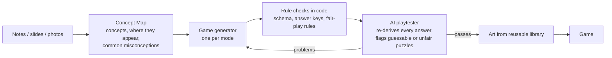

# Playbook

**Turn any unit into a game you can only win by understanding it.**

Live: https://playbook-brown-psi.vercel.app · Built for the CSC Back-to-School Hackathon 2026

Students upload their own class notes, slides, or photos. Playbook maps the unit's key concepts and common mistakes, then builds a game from that exact material — a detective case, an escape room, or a party game for the whole class. Your test date becomes a boss you defeat by mastering each concept.

## The problem

Studying is mostly passive: rereading notes and flashcards. The popular "gamified" tools (Blooket, Gimkit, Kahoot) wrap the same multiple-choice questions in a minigame that has nothing to do with the subject — you answer a question to earn coins, then play. Learning researchers call this *chocolate-covered broccoli*, and students see through it. AI explainers (ChatGPT, Gemini) explain well, but there is nothing to figure out and nothing at stake.

**Playbook makes the concept the game mechanic.** You catch the culprit, open the lock, or spot the impostor *because* you applied the idea — guessing doesn't work.

## What you can play

| Mode | How the concept is the mechanic |
|---|---|
| **Case Files** (solo) | Question characters, earn evidence by asking the right person the right thing, and fill a case board. Board answers are only confirmed two at a time (like *Return of the Obra Dinn*), so you can't guess row by row. The correct answer is always backed by 3+ clues (the *Three Clue Rule* from mystery design). A mentor character teaches the science but never gives the answer. |
| **Escape Room** (solo) | Two rooms of locks that open by computing, predicting, or ordering a process. Each lock yields a fragment; the sealed exit is a meta-puzzle that combines them. Designed to the standard escape-room puzzle rules: one answer, everything clued, no red herrings. |
| **Impostor** (3–10 players) | Everyone gets a fact card on their phone; one is subtly wrong, built from a real misconception. Each player reads their fact and explains *why* it's true — the impostor has to bluff a reason. Secret vouching pairs and scoring for misdirection keep it tense. |
| **Boss Fight** | Your test date becomes a boss. Weak concepts are its shields. Correct answers deal damage, and review questions come back on a spaced schedule (1, 2, 4, 8 days, compressed before test day). |

Every game opens with a **hook question** that creates curiosity before anything is explained, offers a **3-step hint ladder** (nudge → concept → similar worked example, never the answer), and ends with a **debrief** that connects each moment of play to the textbook concept.

## How it works



1. **Concept Map.** Claude reads the uploaded material and extracts 6–10 concepts, where each appears in the notes, and 1–2 common misconceptions per concept (misconceptions become red herrings and wrong-answer feedback).
2. **Generation.** A mode-specific prompt turns the Concept Map into a game as structured data (validated with Zod).
3. **Quality gates.** Before a student sees a game:
   - **Rule checks in code** — every numeric answer is recomputed from its formula, every choice answer exists, concept ids are real, and mode rules hold (Case Files: 3+ clues for the answer, every wrong option made tempting by evidence, 2+ pieces of evidence that must be discovered; Escape Room: one exit meta-lock fed by every other lock; Impostor: the fake fact can't stand out by length).
   - **AI playtester** — a separate Claude review independently derives every answer from the in-game information, tries to solve puzzles *without* the concept, and checks for contradictions and "quiz in costume" design. Serious problems are sent back to the generator (up to 2 repair rounds); if the game still fails, it is not shown.
4. **Play.** Answers are checked **in code, not by AI**. Answer keys, character secrets, and locked clues **never reach the browser** — the server sends a redacted version and releases clues only after a lock is solved. Character chat has a leak guard so a suspect can't blurt out the solution.
5. **Art** comes from a reusable, auto-tagged image library (hand-made with Codex plus generated images), so most games cost nothing extra to illustrate.

### Stack

Next.js (App Router) + TypeScript + Tailwind on **Vercel** · **Supabase** (Postgres + storage) · **Render Workflows** for long-running generation jobs · **Anthropic Claude** for concept mapping, generation, review, and characters · Vercel AI Gateway (FLUX) for images · Zod · mathjs · Vitest (100+ tests).

```
src/
  domain/      Concept Map + game schemas, deterministic answer checking, redaction
  pipeline/    ingest → generate → verify → AI review → assets (repair loop)
  modes/       case/, escape/, impostor/, boss/ — generators, validators, game logic
  app/         pages, API routes, UI components
workflow/      Render Workflow task entry point
supabase/      SQL migrations
```

## Run it locally

```bash
npm install
cp .env.example .env.local   # fill in keys (see below)
npm run dev                  # http://localhost:3000
npm test                     # unit tests
```

Environment: `ANTHROPIC_API_KEY`, `SUPABASE_URL`, `SUPABASE_SERVICE_ROLE_KEY`, `AI_GATEWAY_API_KEY`, `RENDER_API_KEY`, `PIPELINE_MODE` (`inline` locally, `render` in production). Apply the SQL files in `supabase/migrations/` to your Supabase project.

## AI use

AI is used inside the product (Claude builds and reviews the games; image models draw the art) and was used to build it (Claude Code wrote most of the code under my direction; Codex made the art library). See [AI_USE.md](AI_USE.md) for the full log of what AI did and what I decided and verified.

## Research behind the design

- Habgood & Ainsworth, *intrinsic integration*: learning content should be the core mechanic, not a quiz beside it.
- *Return of the Obra Dinn*: deductions confirmed in batches to prevent guessing.
- The Alexandrian's *Three Clue Rule* for mystery design.
- Escape-room puzzle design rules and puzzle-hunt metapuzzles.
- Social deduction (Werewolf, Among Us): bluffing, information asymmetry, verification.
- Learning science: predict-observe-explain, retrieval practice, spaced repetition, curiosity gaps.

## Team

Yuta Kodama

## License

MIT
